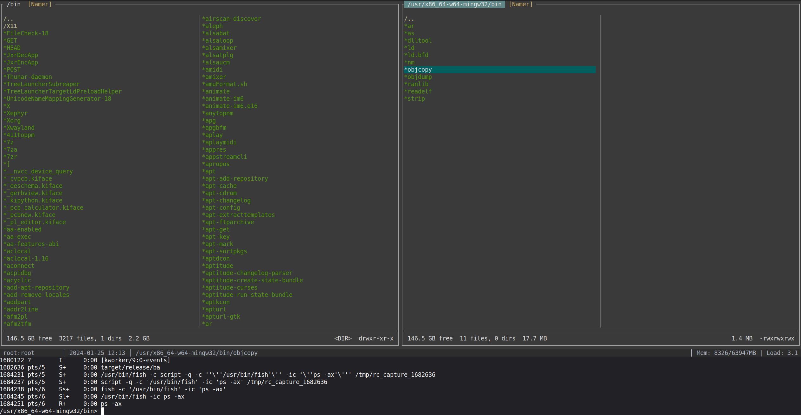

# Bark

A modern Norton Commander / Midnight Commander clone written in Rust with a focus on usability and extensibility.




## Features

- **Dual-panel file manager** with Brief (two-column) and Full (detailed) view modes
- **Remote filesystem support** via SCP/SFTP and WebDAV/WebDAVS
- **Archive browsing** - enter ZIP, TAR, TAR.7Z, 7z, and compressed archives as folders
- **Integrated shell** with command history, output capture, and ANSI color support
- **Built-in file viewer** with text and hex modes
- **User Menu (F2)** for custom commands with hotkeys
- **Git integration** showing branch and status in the status bar
- **Customizable themes** with built-in dark, classic, and light presets
- **File highlighting** based on regex patterns (executables, archives, images, etc.)
- **Plugin system** for providers, viewers, and status bar extensions (any language)
- **File handlers** to open files with external applications based on patterns
- **Favorites** for quick access to frequently used directories
- **Attribute preservation** on copy/move (modification time and permissions) across local, remote, and archive sources
- **Cross-platform** support for Linux, macOS, and Windows

## Installation

### From Source

```bash
git clone https://github.com/yourusername/bark.git
cd bark
cargo build --release
# To install plugins (see below for details): make install-plugins
./target/release/ba
```

### Dependencies

- Rust 2024 edition
- For Linux: libc
- For SCP/SFTP: libssh2 (via ssh2 crate)

## Usage

### Navigation

| Key | Action |
|-----|--------|
| `Up/Down` or `j/k` | Move cursor |
| `Left/Right` or `h/l` | Move between columns / Page up/down |
| `Ctrl+B` / `Ctrl+F` | Page up / Page down (vim-style) |
| `Enter` | Enter directory / Enter archive / Run executable |
| `Backspace` | Go to parent directory |
| `Tab` | Switch active panel |
| `Insert` | Select/deselect file |
| `Home/End` | Go to first/last file |
| `PageUp/PageDown` | Page navigation |
| `Alt+S` | Quick search (jump to file by typing) |
| `Esc` | Exit archive / Clear command line |

### Function Keys

| Key | Action |
|-----|--------|
| `F1` | Help |
| `F2` | User Menu (custom commands) |
| `F3` | View file (or compute folder size) |
| `F4` | Edit file with external editor |
| `F5` | Copy selected files |
| `F6` | Move/rename selected files |
| `F7` | Create new directory |
| `F8` | Delete selected files |
| `F10` | Quit |

### Source Selector (Remote & Archives)

| Key | Action |
|-----|--------|
| `Alt+F1` / `Ctrl+F1` / `Shift+F1` / `Alt+1` | Source selector for left panel |
| `Alt+F2` / `Ctrl+F2` / `Shift+F2` / `Alt+2` | Source selector for right panel |

Multiple bindings are provided because `Alt+F1`/`Alt+F2` may be intercepted by desktop environments (GNOME, KDE, etc.).

The source selector provides access to:
- Quick access paths (Home, Root)
- Saved favorites
- Saved SCP/SFTP connections
- Saved WebDAV connections
- New connection dialogs

### Archive Browsing

Press `Enter` on any supported archive to browse its contents:
- **ZIP** (.zip, .jar, .war, .apk)
- **TAR** (.tar, .tar.gz, .tgz, .tar.bz2, .tbz2, .tar.xz, .txz, .tar.7z)
- **7-Zip** (.7z)
- **Compressed files** (.xz, .gz, .bz2)

Use `F5` to extract files to the other panel. Press `Esc` or navigate to `..` at root to exit.

### Selection

| Key | Action |
|-----|--------|
| `Insert` | Select/deselect file under cursor |
| `Ctrl+A` / `Alt+A` | Select files by pattern |
| `Ctrl+U` | Unmark all selected files |

### Sorting

| Key | Action |
|-----|--------|
| `Ctrl+N` / `Ctrl+F3` | Sort by name |
| `Ctrl+E` / `Ctrl+F4` | Sort by extension |
| `Ctrl+T` / `Ctrl+F5` | Sort by modification time |
| `Ctrl+S` / `Ctrl+F6` | Sort by size |
| `Ctrl+F7` | Unsorted (original order) |
| `Ctrl+H` | Toggle hidden files |

### Shell Integration

| Key | Action |
|-----|--------|
| `:` | Enter command mode |
| `Ctrl+O` | Toggle interactive shell mode |
| `Shift+Up/Down` | Resize shell area |
| `Alt+H` / `F9` | Command history panel |

Commands are executed with full PTY support. TUI programs (vim, htop, etc.) are auto-detected and given full terminal access. Command output is captured and displayed in the shell area with ANSI color support.

### Insert into Command Line

| Key | Action |
|-----|--------|
| `Ctrl+F` | Insert file name |
| `Ctrl+P` | Insert current folder path |
| `Alt+Enter` | Insert full path |

### Resizing Panels

| Key | Action |
|-----|--------|
| `Shift+Left/Right` | Adjust panel width ratio |
| `Shift+Up/Down` | Adjust shell area height |

### Other Keys

| Key | Action |
|-----|--------|
| `Alt+M` | Toggle view mode (Brief/Full) |
| `Alt+/` | Find files |
| `Ctrl+D` | Add current directory to favorites |
| `Alt+T` | Add selected file to temp panel |

## Configuration

Configuration is stored in a platform-specific directory:

| Platform | Config path |
|----------|-------------|
| **Linux** | `~/.config/bark/config.toml` (respects `$XDG_CONFIG_HOME`) |
| **macOS** | `~/Library/Application Support/bark/config.toml` |
| **Windows** | `%APPDATA%\bark\config.toml` |

### Built-in Commands

```
:help / :?         Show built-in commands
:cd [path]         Change directory (cd, cd -, cd ~, relative/absolute)
:config-save       Save configuration
:config-reload     Reload configuration
:config-edit       Open config in editor
:config-upgrade    Add missing options with defaults
:config-reset      Reset config to defaults (with full documentation)
:show-settings     Show current settings
:set <opt>=<val>   Change setting at runtime
:theme <name>      Switch color theme
:themes            List available themes
:highlights        Show loaded file highlighting rules
:q / :quit / :exit Quit
```

### Runtime Settings (`:set`)

```
hidden, show_hidden            Toggle hidden files (active panel)
hidden_both, show_hidden_both  Toggle hidden files (both panels)
view, view_mode                Set view mode (active panel)
view_both, view_mode_both      Set view mode (both panels)
left_view, right_view          Set view mode for specific panel
shell_height                   Shell area height in lines
panel_ratio, ratio             Panel width ratio (0-100)
git, show_git, show_git_status Toggle git status in status bar
dirs_first, dirs_first_both    Directories listed before files
uppercase_first                Uppercase-first sorting
sort, sort_field               Sort field (name, ext, size, time)
sort_both, sort_field_both     Sort field (both panels)
remember_path, remember        Remember panel paths across sessions
theme                          Switch color theme
```

### Example Configuration

```toml
[general]
show_hidden = false
follow_symlinks = true
remember_path = true
edit_mode_always = true
run_executables = true
autosave = false  # Auto-save config on exit
shell = ""  # Override shell (e.g., "pwsh", "cmd.exe", "/bin/zsh"). Empty = auto-detect

[display]
view_mode = "brief"
shell_height = 1
panel_ratio = 50
show_git_status = true

[sorting]
field = "name"
direction = "ascending"
dirs_first = true
uppercase_first = false  # Sort uppercase before lowercase

[editor]
command = ""  # Uses $VISUAL or $EDITOR
viewer = ""   # External viewer command (empty = built-in viewer)

[confirmations]
delete = true     # Confirm before deleting files
overwrite = true  # Confirm before overwriting on copy/move
exit = false      # Confirm before quitting

[theme]
preset = "dark"

# Saved SCP connections
[[connections]]
name = "my-server"
host = "server.example.com"
user = "username"
port = 22
path = "/home/username"

# Saved WebDAV connections
[[webdav_connections]]
name = "my-webdav"
url = "https://dav.example.com/files"
username = "user"

# Favorite directories
[[favorites]]
name = "Projects"
path = "/home/user/projects"

# User menu commands (F2)
[[user_menu]]
name = "Strip binary"
command = "strip !.!"
hotkey = "s"

# File handlers (open files with external apps)
[[handlers]]
pattern = "\\.(jpg|jpeg|png|gif)$"
command = "xviewer {}"

[[handlers]]
pattern = "\\.(mp4|mkv|avi)$"
command = "vlc {}"
```

### User Menu Placeholders

In user menu commands, use these placeholders:
- `!.!` or `%f` - Current filename
- `!.` or `%n` - Filename without extension
- `%e` - File extension
- `%d` - Current directory
- `%s` - Selected files (space-separated)

### Custom Themes

Define custom themes in your config:

```toml
[theme.themes.gruvbox]
base = "dark"
panel_border_active = "#fabd2f"
file_directory = "#83a598"
cursor_bg = "#504945"
```

Then activate with `:theme gruvbox`

### File Highlighting

```toml
[[theme.highlights]]
pattern = "\\.pdf$"
color = "lightblue"
prefix = ">"
```

## Plugins

Bark has an extensible plugin system. Plugins are **standalone executables** that communicate via JSON over stdin/stdout. They are loaded from the `plugins/` subdirectory inside the config directory (e.g., `~/.config/bark/plugins/` on Linux, `~/Library/Application Support/bark/plugins/` on macOS).

### Plugin Types

| Type | Purpose | Examples |
|------|---------|---------|
| **Provider** | Remote/virtual filesystems | FTP, S3, Google Drive, custom archives |
| **Viewer** | Custom file viewers | ELF inspector, image preview, PDF viewer |
| **Status** | Status bar extensions | System memory, disk usage, custom info |

### How It Works

1. Bark scans the plugin directory for executables
2. Each executable is queried with `--plugin-info` to get its type and metadata
3. Provider plugins run as persistent child processes (session-based)
4. Viewer and status plugins run as one-shot processes per request

Plugins can be written in **any language** -- Rust, Python, Go, C, shell scripts, etc. The only requirement is that they speak the JSON protocol.

### Included Plugins

| Plugin | Type | Description |
|--------|------|-------------|
| `bark-ftp` | Provider | FTP/FTPS file access |
| `bark-webdav` | Provider | WebDAV/WebDAVS file access |
| `bark-archive` | Provider | Browse ZIP, TAR, 7z, xz, gz, bz2 archives |
| `bark-elf-viewer` | Viewer | ELF binary header inspector |
| `system_status.py` | Status | System memory and CPU load (Python) |

### Installing Plugins

```bash
# Build and install all plugins
make install-plugins

# Or copy manually
cp my-plugin ~/.config/bark/plugins/
chmod +x ~/.config/bark/plugins/my-plugin
```

### Writing Plugins

See [`docs/PLUGIN_DESIGN.md`](docs/PLUGIN_DESIGN.md) for the full protocol specification, data types, error handling, and complete examples in Rust, Python, Go, and shell.

## File Viewer

The built-in viewer (F3) supports:
- Text mode with line numbers and scrolling
- Hex mode with offset, hex bytes, and CP437 ASCII display (toggle with Tab)
- Search with text patterns (including wildcards) or hex bytes
- Plugin-based viewers for specialized formats (F2 to select)

### Memory-Efficient Large File Viewing

Local files are viewed using memory-mapped I/O for efficiency:
- Only accessed pages are loaded into RAM (OS handles page-level buffering)
- Can view files larger than available RAM
- Fast scrolling with precomputed line offsets
- Remote files (SCP/WebDAV) are fully loaded for viewing

| Key | Action |
|-----|--------|
| `Up/Down`, `j/k` | Scroll line by line |
| `PageUp/PageDown` | Scroll by page |
| `Home/End` | Go to beginning/end |
| `Tab` | Toggle text/hex mode |
| `/` | Search |
| `n/N` | Next/previous match |
| `F2` | Select viewer plugin |
| `Esc`, `q` | Exit viewer |

## Remote Connections

### SCP/SFTP

Connect to remote servers via SSH:
1. Press `Alt+F1`/`Alt+1` or `Alt+F2`/`Alt+2` to open source selector
2. Select "+ New SCP Connection..." or a saved connection
3. Enter host, username, port, and optional path
4. Authenticate with SSH key or password

Connections can be saved for quick access.

### WebDAV

Connect to WebDAV servers (including NextCloud, ownCloud):
1. Press `Alt+F1`/`Alt+1` or `Alt+F2`/`Alt+2` to open source selector
2. Select "+ New WebDAV Connection..." or a saved connection
3. Enter URL and optional credentials

## Platform Notes

### Linux/macOS
- Full feature support
- Uses PTY for proper terminal emulation
- Captures command output using `script`

### Windows
- Drive selection with Alt+F1/F2 (or Alt+1/2)
- Uses native Windows APIs for file operations
- Shell auto-detection: prefers PowerShell 7 (pwsh), then Windows PowerShell, then cmd.exe
- Override with `general.shell` in config (e.g., `shell = "cmd.exe"` or `shell = "pwsh"`)
- Build natively on Windows with the standard Rust MSVC toolchain (`x86_64-pc-windows-msvc`); mingw is only needed for cross-compiling from Linux

## Building

```bash
# Debug build (bark + all plugins)
make debug

# Release build (bark + all plugins)
make release

# Build and install plugins to ~/.config/bark/plugins/
make install-plugins

# Run tests
cargo test

# Clean
make clean
```

### Building on Windows

Install the standard Rust toolchain from [rustup.rs](https://rustup.rs/) (uses the MSVC target by default). Then build normally:

```bash
cargo build --release
```

### Cross-compiling for Windows from Linux/macOS

```bash
make setup      # Install mingw-w64 cross-compiler (one-time)
make windows    # Cross-compile .exe binaries using x86_64-pc-windows-gnu
```

## License

MIT License

## Acknowledgments

Inspired by Norton Commander and Midnight Commander.

Built with:
- [ratatui](https://github.com/ratatui-org/ratatui) - Terminal UI framework
- [crossterm](https://github.com/crossterm-rs/crossterm) - Cross-platform terminal library
- [portable-pty](https://github.com/wez/wezterm/tree/main/pty) - PTY support
- [ssh2](https://github.com/alexcrichton/ssh2-rs) - SSH/SFTP for remote connections
- [memmap2](https://github.com/RazrFalcon/memmap2-rs) - Memory-mapped file I/O
- [filetime](https://github.com/alexcrichton/filetime) - Cross-platform file timestamp modification
